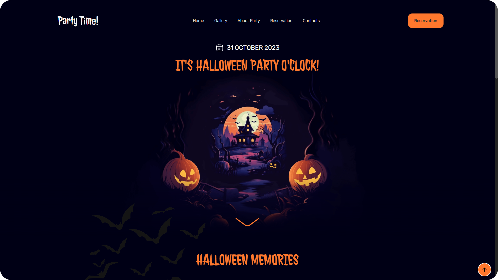
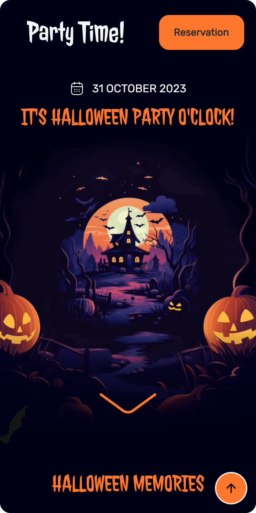

<h1 align="center">Projeto de Estudo: Party Time</h1>

> Projeto de estudo desenvolvido com a finalidade de melhorar as minhas habilidades com frontend.

 

## Imagens do Projeto:

#### 01. Desktop:

<small>Imagem da versão Desktop do site.</small>

#### 02. Mobile:

<small>Imagem da versão mobile do site.</small>
